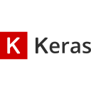

# Hi there, I'm Audric Girondin ! 👋

## About Me

I'm Audric Girondin, a passionate software developer and AI enthusiast. I love building innovative solutions and exploring new technologies, especially in the field of artificial intelligence and machine learning. I'm also a Master's student in Applied Mathematics and Computer Science.

- 🔭 I’m currently working on various AI and ML projects
- 🌱 I’m currently learning advanced machine learning techniques and deep learning
- 💬 Ask me about AI, machine learning, and software development
- ⚡ Fun fact: I love to travel and explore new cultures, play golf, and fly drones

## Projects

Here are some of my notable projects:

### [🟦 AudricTron : An AI-Powered Tron Game 🟨](https://github.com/aaudric/audricTron)
A Tron game enhanced with AI where players are controlled using neural networks. The AI is trained using Keras to make smart movement decisions.

### [CarGame 🚘](https://github.com/aaudric/CarGame)
The implementation of a car game developed using Pygame and a DQN (Deep Q-Network) agent for reinforcement learning. 

### [Gender-and-Age-Detection 👴🏼 👵🏼](https://github.com/aaudric/Gender-and-Age-Detection)
This project uses deep learning to predict gender and age from facial images.

### [🌹🌻 Flower Classification with CNN 🌼🌺](https://github.com/aaudric/Flower-Classification-with-CNN)
This project uses Convolutional Neural Networks (CNN) to classify images of flowers into different categories. The dataset consists of flower images categorized into five classes.

### [FrozenLake ❄️🕹️☃️](https://github.com/aaudric/FrozenLake)
This project implements a Deep Q-Learning (DQN) agent to solve the FrozenLake environment from OpenAI's Gym. The agent uses a neural network to approximate the Q-value function and employs experience replay to learn from past experiences.

### [MNIST Classification 🔢](https://github.com/aaudric/MNIST)
This project demonstrates the use of a Convolutional Neural Network (CNN) to classify handwritten digits from the MNIST dataset.

### [🤯 Alzheimer's Disease Predictions 🧠](https://github.com/aaudric/Alzheimer-s-Disease-Predicctions)
This project aims to predict Alzheimer's Disease using various machine learning and deep learning models. The models' performances are evaluated using metrics such as accuracy, recall, F1 score, and ROC AUC score.

### [INM-Explain](https://github.com/alyasltd/TER-2023-2024-Visualisations_de_tweets_controverses)
Contribution during study and research work at the Paul Valéry III University of Montpellier with LIRMM and Janssen Horizon. Analysis of controversial tweets around health and INM.

### [Big Data Project : Sales Analysis with PySpark](https://github.com/aaudric/Projet-Big-Data)
This project involves analyzing sales data using PySpark to extract insights and patterns from the data. The analysis includes data preprocessing, exploratory data analysis, and machine learning model building.

### [Challenge Data SNCF 🚉](https://github.com/aaudric/Challenge-Data-SNCF)
This project aims to predict the daily number of station validations in the Île-de-France region for SNCF-Transilien, using machine learning and deep learning models applied to multivariate time series data.

## Languages and Tools 

### Languages :
| Python3 | Rstudio | Csharp | HTML 5 | JS | CSS3 |
|----------|----------|----------|----------|----------|----------|
|   |  |  |  |   |  | 

  

### Best frameworks and main libraries for Python3 :

| Tensorflow | Keras | NumPy | Pandas | Sklearn | Matplotlib | 
|----------|----------|----------|----------|----------|----------|
|  |  |  |  |  |  |

### My tools for Data Manipulation :

Jupyter | MySQL | Postgres |
|----------|----------|----------|
||||

## GitHub Stats

  

## GitHub Activity Graph

    
     
    

## Contact Me

- Linkedin : [Audric Girondin](https://www.linkedin.com/in/audric-girondin/) 

